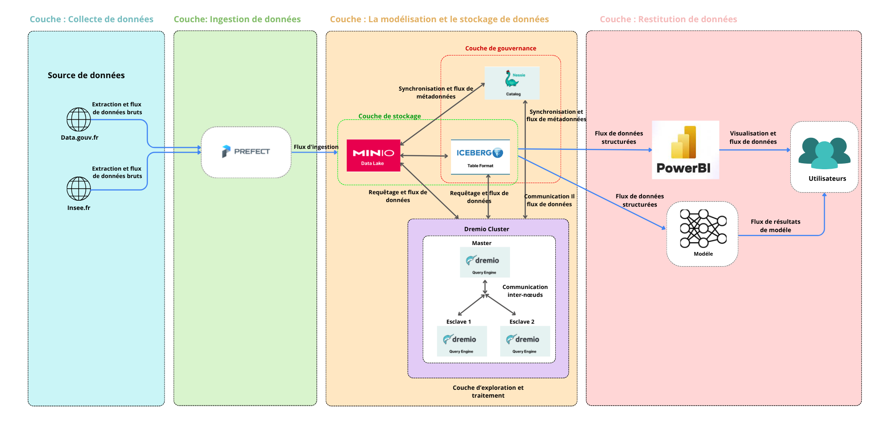

# 🏛️ ELECTIO-ANALYTICS

**Système Complet d'Orchestration ETL et Analytics**

---

## 📊 Architecture Système



*Diagramme d'architecture complète du système Electio-Analytics montrant les 4 couches principales : Collecte, Ingestion, Stockage & Gouvernance, Exploration & Restitution*

---

## 📋 Table des Matières

1. [Description Générale](#description-générale)
2. [Architecture Technique Détaillée](#architecture-technique-détaillée)
3. [Structure des Fichiers](#structure-des-fichiers)
4. [Flux de Données ETL](#flux-de-données-etl)
5. [Prérequis](#prérequis)
6. [Installation et Configuration](#installation-et-configuration)
7. [Commandes Principales](#commandes-principales)
8. [Guide d'Utilisation](#guide-dutilisation)
9. [Accès aux Interfaces](#accès-aux-interfaces)
10. [Structures de Données](#structures-de-données)
11. [Troubleshooting](#troubleshooting)

---

## 1. Description Générale

**ELECTIO-ANALYTICS** est un système complet d'orchestration ETL et d'analytics dédiée aux données d'élections françaises. Il collecte, enrichit et transforme des datasets provenant de data.gouv.fr et les intègre dans un data lake.

### 🎯 Objectifs

- ✅ Collecte automatisée de datasets gouvernementaux
- ✅ Stockage structuré et versionné des données
- ✅ Transformation progressive des données (RAW → BRONZE → GOLD)
- ✅ Exploration interactive via Dremio
- ✅ Gouvernance des données et traçabilité complète

### 🛠️ Technologies Principales

| Technologie | Rôle |
|---|---|
| **Prefect 3.x** | Orchestration des workflows |
| **MinIO** | Data Lake Storage (S3-compatible) |
| **Dremio** | Query Engine & BI Discovery |
| **Nessie** | Iceberg Catalogue (versioning) |
| **PostgreSQL** | Base de données Prefect |
| **Docker Compose** | Containerization |
| **SQL** | Transformations de données |

---

## 2. Architecture Technique Détaillée

### 2.1 Couches de l'Architecture

#### 🔵 Couche 1: Collecte de Données

```
SOURCES (data.gouv.fr, insee.fr)
         ↓
   PREFECT FLOW (datagouv_to_minio.py)
         ↓
   MinIO RAW Zone (datalake/raw_2/)
```

**Fonction:**
- Téléchargement parallèle des datasets
- Validation des fichiers
- Ingestion dans la RAW zone
- Logging et monitoring

#### 🟢 Couche 2: Ingestion des Données

- **Prefect Orchestrator** : Coordination des workflows
- **PostgreSQL** : État des jobs, métadonnées
- **MinIO** : Stockage centralisé

**Fonction:**
- Orchestration automatisée des flows
- Gestion des dépendances
- Retry automatique en cas d'erreur
- Tracking des exécutions

#### 🟠 Couche 3: Stockage et Versioning (Data Lake)

```
datalake/
├── raw_2/        (Données brutes)
│   ├── elections/
│   ├── chomage/
│   └── securite/
├── bronze/       (Données nettoyées)
└── gold/         (Données agrégées)
```

**Stockage:**
- **MinIO** : Data Lake Object Storage (S3-compatible)
- **Nessie Catalogue** : Apache Iceberg (versioning)

**Fonction:**
- Stockage immuable des données
- Versioning des datasets
- Traçabilité complète
- Récupération temporelle (time-travel)

#### 🟡 Couche 4: Transformation et Modélisation

**Pipelines SQL:**

| Fichier | Fonction |
|---|---|
| `ETL1_RAW_vers_BRONZE.sql` | Nettoyage & Standardisation |
| `ETL2_BRONZE_vers_GOLD.sql` | Agrégation & Enrichissement |
| `03_ETL_GOUVERNANCE.sql` | Quality & Audit |

#### 🔴 Couche 5: Exploration et Restitution

- **Dremio UI** : Exploration interactive
- **PowerBI** : Visualisations métier
- **API REST** : Intégrations tierces

---

## 3. Structure des Fichiers

```
mspr1/
├── 📄 README.md                              [Ce fichier]
├── 📄 README.txt                             [Version texte]
├── 📷 architecture-diagram.png               [Schéma d'architecture]
│
├── 🐳 docker-compose.yaml                    [Configuration Docker]
├── ⚙️ dremio-coordinator.conf               [Config Dremio]
├── ⚙️ dremio-worker.conf                    [Config Workers]
│
├── 📝 commmande_prefect.txt                  [Commandes Prefect]
│
├── 🔄 ETL1_RAW_vers_BRONZE.sql              [Transformation RAW→BRONZE]
├── 🔄 ETL2_BRONZE_vers_GOLD.sql             [Transformation BRONZE→GOLD]
├── 📊 03_ETL_GOUVERNANCE.sql                [Gouvernance & Qualité]
│
├── 📁 flows/                                 [Dossier Prefect]
│   ├── datagouv_to_minio.py                 [Flow principal]
│   ├── prefect.yaml                         [Config Prefect]
│   ├── requirements.txt                     [Dépendances Python]
│   └── README.txt                           [Doc flows]
│
└── 📁 ea-pdfs-shared/                       [Ressources partagées]
```

---

## 4. Flux de Données ETL

### RAW Zone → BRONZE Zone → GOLD Zone

```
data.gouv.fr/insee.fr
        ↓
    PREFECT FLOW
        ↓
    MinIO RAW (datalake/raw_2/)
        ↓
    DREMIO Query Engine
        ↓
    ETL1: RAW_vers_BRONZE
    ├─ Nettoyage
    ├─ Standardisation
    └─ Enrichissement
        ↓
    MinIO BRONZE
        ↓
    ETL2: BRONZE_vers_GOLD
    ├─ Agrégation
    ├─ Star Schema
    └─ Enrichissement
        ↓
    MinIO GOLD + Nessie Versioning
        ↓
    DREMIO UI / PowerBI
        ↓
    Utilisateurs
```

### Zones ETL

| Zone | Location | Format | Immuabilité | Fonction |
|---|---|---|---|---|
| **RAW** | `datalake/raw_2/` | Original | Write-once | Données brutes |
| **BRONZE** | `datalake/bronze/` | Standardisé | Immutable | Données nettoyées |
| **GOLD** | `datalake/gold/` | Optimisé | Immutable | Données métier |

---

## 5. Prérequis

### 💻 Environnement Système

```
OS:     Windows 10/11 ou Linux/macOS
CPU:    Minimum 4 cores (8 cores recommandés)
RAM:    Minimum 8GB (16GB recommandés)
Disque: 50GB libre
```

### 📦 Logiciels Requis

- ✅ Docker Engine (v20.10+)
- ✅ Docker Compose (v2.0+)
- ✅ Python 3.9+ (optionnel)
- ✅ Git (optionnel)

### 🔌 Ports Requis

| Service | Port | Fonction |
|---|---|---|
| Dremio UI | 9047 | Web Interface |
| Dremio Engine | 31010 | Query Processing |
| MinIO API | 9000 | Object Storage |
| MinIO Console | 9001 | Web Console |
| Nessie API | 19120 | Iceberg Catalogue |
| PostgreSQL | 5432 | Database |

### 🔑 Credentials

```
MinIO:      eaadmin / eaadmin123
Dremio:     admin@dremio.local / Dremio123!
PostgreSQL: postgres / postgres
```

⚠️ **À CHANGER EN PRODUCTION!**

---

## 6. Installation et Configuration

### 6.1 Installation Rapide

```bash
# 1. Cloner le projet
git clone <repository-url>
cd mspr1

# 2. Créer les volumes Docker
docker volume create ea-dremio-coordinator-data
docker volume create ea-dremio-worker-1-data
docker volume create ea-dremio-worker-2-data
docker volume create ea-minio-data
docker volume create ea-nessie-data

# 3. Démarrer les services
docker-compose up -d

# ⏳ Attendre 2-3 minutes pour l'initialisation

# 4. Vérifier l'état
docker-compose ps
```

### 6.2 Vérification Post-Installation

| Service | URL | Credentials |
|---|---|---|
| **Dremio** | http://localhost:9047 | admin / Dremio123! |
| **MinIO** | http://localhost:9001 | eaadmin / eaadmin123 |
| **Nessie** | http://localhost:19120 | (No auth) |

### 6.3 Configuration Prefect

```bash
# Accéder au conteneur Prefect
docker-compose exec prefect-server bash

# Créer le Work Pool
prefect work-pool create default --type process

# Déployer le flow
cd /opt/flows
prefect deploy --name datagouv-minio-deployment
```

### 6.4 Configuration Dremio

1. Accéder à http://localhost:9047
2. **Admin Settings** → **Data Sources** → **New Source**
3. Configurer MinIO:
   - Type: Amazon S3
   - Endpoint: `http://ea-minio-storage:9000`
   - Access Key: `eaadmin`
   - Secret Key: `eaadmin123`
   - Bucket Path: `datalake/`

---

## 7. Commandes Principales

### 🐳 Docker Compose

```bash
# Démarrer
docker-compose up -d

# Arrêter
docker-compose stop

# Arrêter et nettoyer
docker-compose down

# Voir les logs
docker-compose logs -f ea-dremio-coordinator

# Vérifier l'état
docker-compose ps
```

### 🎯 Prefect

```bash
# Lister les work pools
docker-compose run --rm prefect-server prefect work-pool ls

# Créer un work pool
docker-compose run --rm prefect-server prefect work-pool create default --type process

# Lancer un flow
docker-compose run --rm prefect-server prefect deployment run datagouv-minio-deployment

# Lister les deployments
docker-compose run --rm prefect-server prefect deployment ls
```

### 📦 MinIO (S3)

```bash
# Lister les buckets
docker-compose exec ea-minio-storage mc ls local/

# Lister contenu
docker-compose exec ea-minio-storage mc ls local/datalake/raw_2/ --recursive

# Télécharger un fichier
docker-compose exec ea-minio-storage mc cp local/datalake/raw_2/elections/file.xlsx /tmp/
```

### 🔍 Dremio SQL

```bash
# Via Query Workbench: http://localhost:9047
# Coller et exécuter les fichiers SQL:
# - ETL1_RAW_vers_BRONZE.sql
# - ETL2_BRONZE_vers_GOLD.sql
# - 03_ETL_GOUVERNANCE.sql
```

---

## 8. Guide d'Utilisation

### Scénario Complet: Collecte à Restitution

#### ✅ Étape 1: Collecte des Données

```bash
docker-compose run --rm prefect-server prefect deployment run datagouv-minio-deployment
```

**Résultat attendu:**
- ✓ Téléchargement parallèle
- ✓ Stockage dans MinIO (datalake/raw_2/)
- ✓ Status: SUCCESS

#### ✅ Étape 2: Vérifier les Données Brutes

```bash
docker-compose exec ea-minio-storage mc ls local/datalake/raw_2/ --recursive
```

#### ✅ Étape 3: Transformation RAW → BRONZE

1. Accéder à http://localhost:9047
2. **Query Workbench**
3. Coller le contenu de `ETL1_RAW_vers_BRONZE.sql`
4. Cliquer sur **Run**

#### ✅ Étape 4: Transformation BRONZE → GOLD

1. Coller le contenu de `ETL2_BRONZE_vers_GOLD.sql`
2. Exécuter

#### ✅ Étape 5: Gouvernance et Qualité

1. Coller le contenu de `03_ETL_GOUVERNANCE.sql`
2. Exécuter

#### ✅ Étape 6: Exploration et Restitution

- Via **Dremio UI** : http://localhost:9047 → Datasets
- Via **PowerBI** : Data → New Source → Web → http://localhost:9047

---

## 9. Accès aux Interfaces

| Interface | Port | URL | Credentials |
|---|---|---|---|
| 🎨 **Dremio UI** | 9047 | http://localhost:9047 | admin / Dremio123! |
| 📦 **MinIO Console** | 9001 | http://localhost:9001 | eaadmin / eaadmin123 |
| 📡 **MinIO API** | 9000 | http://localhost:9000 | (S3-style) |
| 📊 **Nessie API** | 19120 | http://localhost:19120 | (No auth) |
| 🗄️ **PostgreSQL** | 5432 | localhost:5432 | postgres / postgres |

---

## 10. Structures de Données

### RAW Zone

```
datalake/raw_2/
├── elections/
│   └── resultats-par-niveau-burvot-t1-france-entiere.xlsx
├── chomage/
│   └── taux-chomage-trimestriel.csv
└── securite/
    └── crimes-delits-enregistres.csv
```

### BRONZE Zone (Tables nettoyées)

```sql
-- ETL1_RAW_vers_BRONZE.sql

ELECTIONS_BRONZE
├── id (PK)
├── type_bureau
├── votes_candidate
├── commune_id (FK)
├── date_scrutin
└── ...

CHOMAGE_BRONZE
├── id (PK)
├── region
├── taux_chomage
├── periode
└── ...

SECURITE_BRONZE
├── id (PK)
├── commune
├── type_crime
├── nombre
└── ...
```

### GOLD Zone (Star Schema)

```sql
-- FACT TABLES
FACT_ELECTIONS
├── elections_key (PK)
├── candidate_id (FK)
├── territory_id (FK)
├── date_id (FK)
├── votes_total
└── pourcentage_votes

FACT_CHOMAGE
├── chomage_key (PK)
├── territory_id (FK)
├── date_id (FK)
├── taux_chomage
└── nombre_chomeurs

-- DIMENSION TABLES
DIM_TERRITORY
├── territory_id (PK)
├── commune
├── canton
├── departement
├── region
└── pays

DIM_DATE
├── date_id (PK)
├── jour, mois, annee
├── trimestre
└── jour_semaine

DIM_CANDIDATE
├── candidate_id (PK)
├── nom, prenom
├── parti
└── region_origine
```

---

## 11. Troubleshooting

### ❌ Problème 1: Les conteneurs ne démarrent pas

```bash
# Vérifier les logs
docker-compose logs ea-dremio-coordinator

# Vérifier les ports libres
netstat -an | grep 9047

# Réinitialiser
docker-compose down -v
docker-compose up -d
```

### ❌ Problème 2: Dremio ne voit pas MinIO

```bash
# Vérifier la connectivité
docker-compose exec ea-dremio-coordinator ping ea-minio-storage

# Voir logs MinIO
docker-compose logs ea-minio-storage

# Reconfigurer dans Dremio UI
# Admin Settings → Data Sources → Reconfigurer MinIO
```

### ❌ Problème 3: Prefect Flow ne collecte pas les données

```bash
# Vérifier connexion Internet
docker-compose exec prefect-server ping 8.8.8.8

# Vérifier les URLs data.gouv.fr
curl -I https://static.data.gouv.fr/resources/...

# Voir logs du flow
docker-compose run --rm prefect-server prefect flow-run ls
```

### ❌ Problème 4: Erreur SQL dans les transformations

```sql
-- Vérifier que les tables sources existent
SELECT * FROM sys.tables WHERE table_name LIKE 'ELECTIONS_%'

-- Vérifier les permissions
-- Vérifier la syntaxe (Dremio = PostgreSQL dialect)
```

### ❌ Problème 5: Performance lente

```bash
# Augmenter la mémoire Dremio dans docker-compose.yaml
- DREMIO_JAVA_EXTRA_OPTS=-Xmx8g -XX:MaxDirectMemorySize=8g

# Redémarrer
docker-compose restart ea-dremio-coordinator
```

---

## 📚 Documentation Officielle

- 🔗 [Dremio Docs](https://docs.dremio.com)
- 🔗 [Prefect Docs](https://docs.prefect.io)
- 🔗 [MinIO Docs](https://docs.min.io)
- 🔗 [Nessie Docs](https://projectnessie.org)
- 🔗 [Apache Iceberg](https://iceberg.apache.org)

---

## 📞 Support

Pour des questions ou des signalements de bugs:

1. ✅ Consulter ce README en premier
2. ✅ Consulter la section [Troubleshooting](#troubleshooting)
3. ✅ Vérifier les logs Docker
4. ✅ Consulter la documentation officielle
5. 📧 Contacter l'équipe de développement

---

## 📝 Changelog

### Version 1.0 (Initial Release)

- ✅ Architecture complète ETL
- ✅ Intégration Prefect + MinIO + Dremio + Nessie
- ✅ 3 pipelines SQL (RAW → BRONZE → GOLD)
- ✅ Gouvernance et qualité des données
- ✅ Collecte automatisée data.gouv.fr

---

## ⚖️ License et Conformité

**Ce projet est dédié au traitement des données électorales publiques françaises.**

### Conformité:
- ✅ RGPD: Respect de la protection des données
- ✅ CNIL: Conformité avec réglementation française
- ✅ Open Data: Utilisation de données gouvernementales publiques
- ✅ Licenses: Respecter les licenses des sources de données

### Utilisation:
- Usage académique et de recherche
- Conformité avec les conditions d'utilisation data.gouv.fr

---

**Mis à jour:** Mai 2026 | **Version:** 1.0.0 | **Auteur:** Electio-Analytics Team

*Pour toute question ou amélioration, consulter le repository GitHub.*
